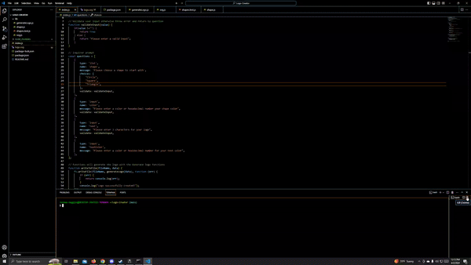

# SVG Logo-Creator

## Description

This application was built to allow freelance web developers to make 
simple logos for their own projects in order to avoid generating extra
costs by paying for a graphic designer. The node application will 
provide prompts to allow users to select certain aspects to create
the logo.

## Installation and Usage

Downloading the repo will download all dependencies and code to make
the node.js application work. After downloading and navigating the 
repo, users can input "node index.js" into the terminal to start the
application where users will then answer a series of questions that 
are prompted on the terminal. After going through all the questions 
users will then be able to pull up a generated logo.

## Demo

for a video walkthrough of the gif follow this link: https://www.youtube.com/watch?v=mpAFV80DV8k

## Tests

Users can run a test using "npm run test" using jest.

